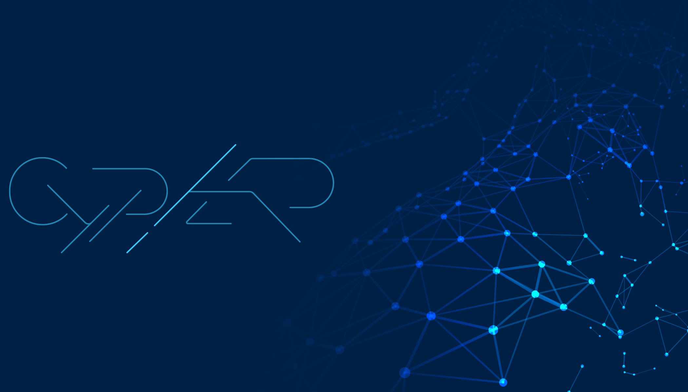

<div align="center">
  
</div>

<div align="center">

# ⬡ D|G ARQUITETOS

**DG ARQUITETOS → ONDE A VISÃO SE TORNA REALIDADE**

_Site Institucional da Boutique de Arquitetura de Referência em Angola._

[](https://dg-arquitetos.vercel.app)
[](#)
[](#11--licença)
[](#)
[](#)

</div>

---

## 01 — Sobre o Projeto

A **D|G Arquitetos** é uma boutique de arquitetura sediada em Angola, focada no mercado de luxo e projetos de alta complexidade. Este repositório contém o **site institucional** da marca — uma plataforma digital imersiva desenvolvida pela **CYPHER**, desenhada para transpirar exclusividade, precisão técnica e sofisticação.

> **Não projetamos apenas edifícios. Criamos refúgios que equilibram luxo absoluto e conforto orgânico.**

### Posicionamento e Objetivo

- **Portfólio de Luxo:** Exibição de alta fidelidade dos projetos residenciais e comerciais.
- **Autoridade Estética:** Uma interface que reflete a precisão e o minimalismo dos traços da DG.
- **Experiência Imersiva:** Uso de animações fluidas para guiar o cliente pela visão arquitetónica da marca.

---

## 02 — Visão & Missão

### 👁🗨 Visão

Ser a referência em arquitetura contemporânea de luxo na África Lusófona, transformando a paisagem urbana com obras que são testamentos de durabilidade, beleza e funcionalidade estratégica.

### 🎯 Missão

Materializar a visão de cada cliente através de uma arquitetura holística. Cada linha traçada é uma decisão estratégica para maximizar a beleza e o valor, entregando espaços que elevam o estilo de vida e protegem o investimento a longo prazo.

---

## 03 — Stack Tecnológica

O _core_ tecnológico foi selecionado pela **CYPHER** para garantir performance instantânea e uma experiência de luxo sem interrupções.

### Frontend

| Tecnologia          | Defesa Arquitectural                                                |
| ------------------- | ------------------------------------------------------------------- |
| **React 18**        | Modularidade e performance reactiva.                                |
| **Vite 6**          | HMR ultra-rápido e builds otimizados.                               |
| **Tailwind CSS v4** | Estilização moderna e consistência de design tokens.                |
| **Framer Motion**   | Transições fluidas de 60fps para uma navegação premium.             |
| **Lucide Icons**    | Iconografia minimalista e escalável.                                |

### Infraestrutura e Deploy (Recomendado)

- **Hospedagem:** Vercel (Optimized for React/Vite)
- **CI/CD:** GitHub Actions Automation

---

## 04 — Arquitetura do Projeto

Implementamos o padrão _Component-Based Modular Architecture_ para garantir escalabilidade:

```text
/src
 ├── assets/          # SVG Vectors, Imagens de fundo
 ├── components/      # (Smart & Dumb Components)
 │    ├── sections/   # Hero, About, Portfolio, Process, Services
 │    └── ui/         # Buttons, Nav, Modals
 ├── App.jsx          # Master Layout & Section Orchestration
 └── index.css        # Tailwind Native Configuration
```

---

## 05 — Performance & Luxury UX

- **100% Mobile Optimized:** Renderização fluída em todos os dispositivos.
- **Auto-Play Expertise:** Apresentação dinâmica de serviços com ciclos de 3 segundos.
- **WhatsApp Integration:** Fluxo de contacto direto para agilizar reuniões de prestígio.
- **Scroll Logic:** Navigation Bar inteligente que desaparece para priorizar o conteúdo visual.

---

## 06 — Como Rodar o Projeto

Assegura-te que possuís o **Node.js** instalado.

### Instalação

```bash
# 1. Obter o repositório
git clone https://github.com/cyphercode30/dg.arquitetos.git
cd dg.arquitetos

# 2. Instalar dependências
npm install
```

### Desenvolvimento

```bash
npm run dev
# localhost:5173
```

---

## 07 — Convenções de Código

- **Clean Naming:** Componentes em `PascalCase`.
- **Performance:** Uso de hooks otimizados e animações via GPU.
- **Zero Templates:** Todo o código é proprietário e customizado.

---

## 08 — Licença

**Proprietária – D|G Arquitetos & CYPHER © 2026 Todos os direitos reservados.**

Este projecto é **Closed Source**. Não é permitida a replicação sem autorização explícita da **D|G Arquitetos** ou da **CYPHER**.
